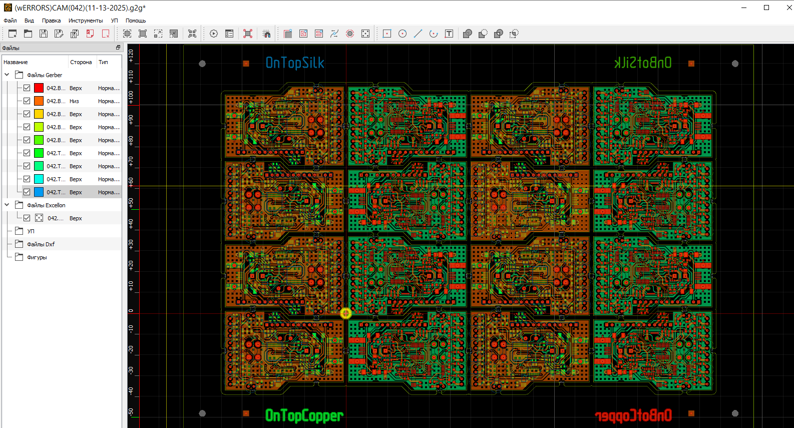

# GERBER_X3
V0.7.9

Программа для подготовки Г-кода из файлов Gerber (RS-274X Revision 2020.09) для фрезеровки плат на ЧПУ.
Частичная поддержка файлов DXF.
Просмотрщик,редактор Гербер-файлов, создатель G-code - это программа сделана для Схематор&Платформ https://github.com/niconson/PlatForm [https://github.com/niconson/FreePCB-2]

Требуемая для сборки библиотека qt 5.12.10 либо 5.12.12.

Сборка в VS 2022, но необходимо использовать плптатформу Visual Studio 2017 (v141) с++ , расширение qt vs tool версии 2.10 (ДЛЯ wimdows 7) или 3.4.1 (для windows 10 и выше)

Поддерживаемые ОС Windows 7 и выше.

Rutube примеры обучения https://rutube.ru/video/693c69bfa10a9716b1bbb56b58717436/ Релиз-x64: https://github.com/niconson/Gerber_X3-0.7.9_release

Gerber viewer and editor, g-code maker.Тhis program is made for Schemator&Platforms [https://github.com/niconson/FreePCB-2], (https://github.com/niconson/PlatForm)

Required for building library qt 5.12.10 or 5.12.12.

Build in VS 2022, c++ , platform Visual Studio 2017 (v141) с++, qt vs tool extension version 2.10 (for windows 7) or 3.4.1 (windows 10 and higer)

Supported OS Windows 7 and above

Rutube leaarning example https://rutube.ru/video/693c69bfa10a9716b1bbb56b58717436/

Release x64 : https://github.com/niconson/Gerber_X3-0.7.9_release

Program for preparing G-code from Gerber (RS-274X Revision 2020.09) files for CNC milling.
Partial support for DXF files.

Другие версии программы:

Other versions:

* Windows: [x86](https://github.com/XRay3D/GERBER_X2/releases)
* Windows: [amd64](https://github.com/XRay3D/GERBER_X2/releases)

